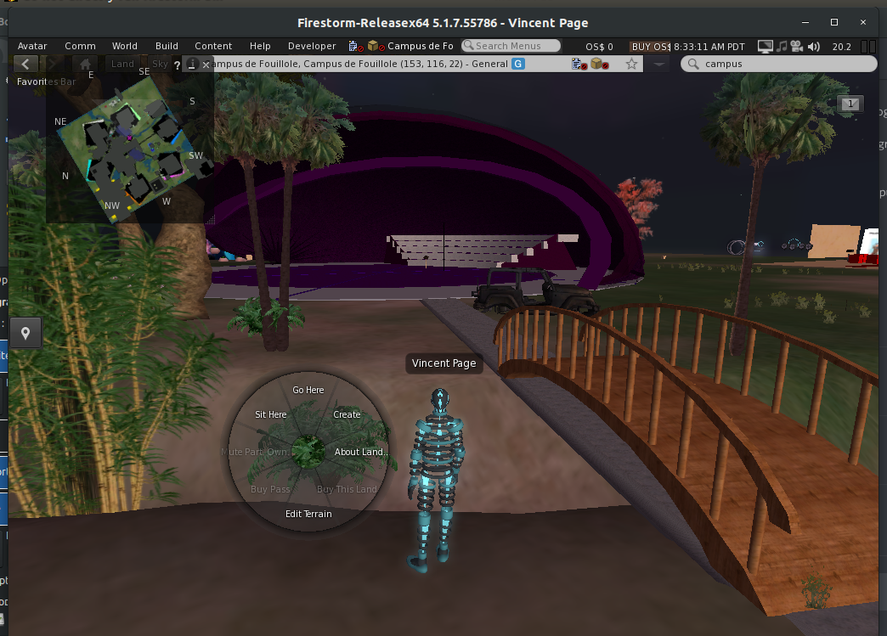

# Wi-Bash OpenSim

Ou l'on va développer les mondes virtuels déja existants de M. Guerlotté...

## Comment se loguer
Le **campus virtuel de l'UA** est sur la grille francophone de l'association Francogrid.

1. Pour avoir un avatar sur cette grille, il faut donc se créer un compte utilisateur (gratuit) sur le site de Francogrid : [http://www.francogrid.org/](http://www.francogrid.org/)

2. Pour se ballader sur OpenSim il faut télécharger un viewer 3D dans sa version qui est compatible avec Francogrid. Par exemple : *firestormviewer* téléchargeable ici : [http://www.firestormviewer.org/downloads/](http://www.firestormviewer.org/downloads/)

3. Choisir la grille de Francogrid (à la place de Second Life), Renseigner le nom de votre Avatar et le password puis Connexion

4. Quand on est sur la région accueil de francogrid, il suffit de se téléporter sur la région Campus de Fouillole. Pour être honnête, j'ai mis un temps fou pour arriver à faire ceci, alors en version rapide, cela donne :
  - Menu World -> World Map -> taper campus de fouillole -> search.

## Une petite image juste pour se faire une idée

## Comment contribuer
Cela reste a définir, je ne sais pas si l'on va cloner le campus réel ou développer un campus virtuel aussi beau que possible.
Peut etre aurez vous une idée...
